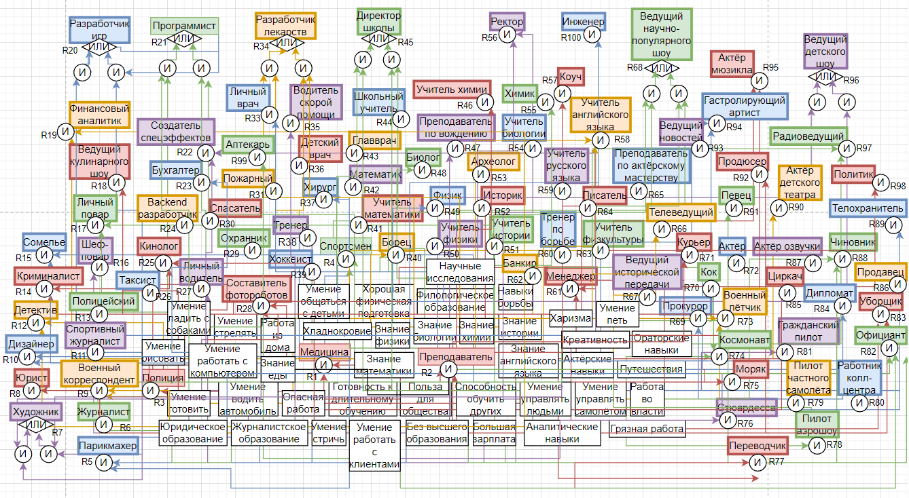
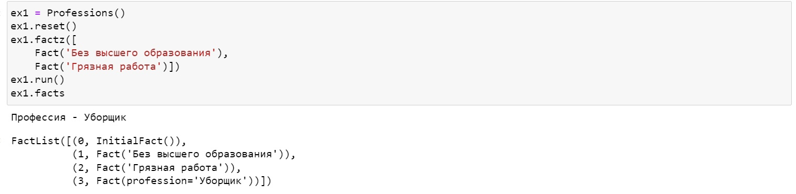
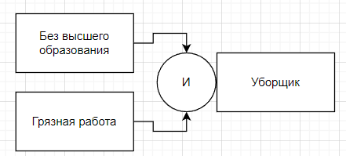
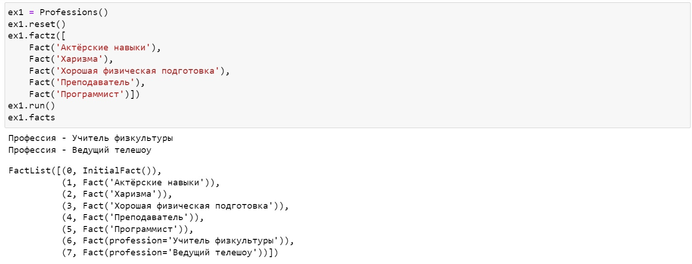
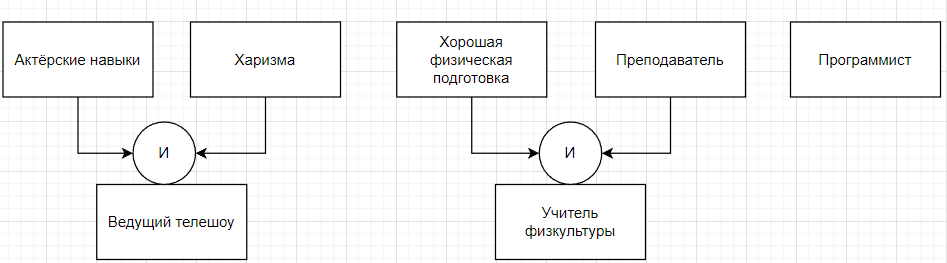
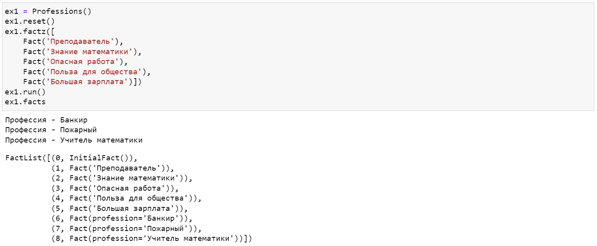
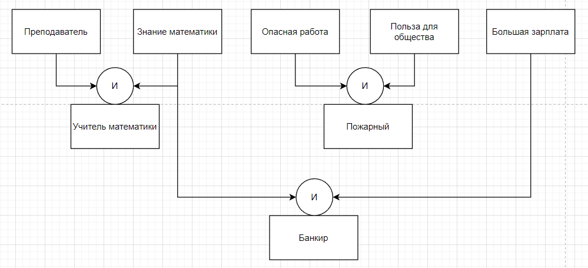

# Отчет по лабораторной работе
## по курсу "Искусственый интеллект"

### Студенты: 

| ФИО           | Роль в проекте                            | Оценка       |
|---------------|-------------------------------------------|--------------|
| Сазонов В.С.  | Описал общую схему предметной области     |              |
| Гаврилин М.Ю. | Написал 33 правила на Python, тестирование|              |
| Цыбенко Д.С.  | Написал 33 правила на Python              |              |
| Ткаченко А.В. | Написал 34 правила на Python              |              |
| Николаева Е.С.| Написание отчёта                          |              |


> *Комментарии проверяющих (обратите внимание, что более подробные комментарии возможны непосредственно в репозитории по тексту программы)*

## Тема работы

Реализация экспертной системы для выбора профессии.

## Концептуализация предметной области

Предметная область делится на навыки, классы профессий и профессии.
Они соединены деревом И-ИЛИ.
Предметная область могла бы быть разделена следующим образом. Творческие профессии и социально-полезные профессии.


## Принцип реализации системы

Мы решили воспользоваться прямым выводом. Для этого достаточно было воспользоваться CLIPS с помощью библиотеки на python Pyknow. Prolog мы помнили хуже, чем python, поэтому выбор лег именно на этот язык программирования.

## Механизм вывода

Мы узнаем интересы нашего пользователя и заносим их в список фактов о нем. В Pyknow заданы правила с помощью которых факты из списка проверяются и доказываются, а впоследствии добавляются в память. Это повторяется до тех пор пока мы не найдем интересующие нас утверждения.

## Извлечение знаний и база знаний

Извлечение знание происходило следующим образом. Вспоминались профессии, сначала наиболее популярные. Когда такие закончились, пришлось вспоминать экзотические профессии.
Правила в системе Pyknow
```
class Professions(KnowledgeEngine):
    @Rule(AND(Fact('Готов к длительному обучению'),Fact('Польза для общества')))      
    def Medicine(self):
        self.declare(Fact('Медицина'))
        
    @Rule(AND(Fact('Медицина'),Fact('Хладнокровие')))
    def surgeon(self):
        self.declare(Fact(profession='Хирург'))

    @Rule(
          AND(Fact('Медицина'),Fact('Умение общаться с детьми')))
    def pediatrician(self):
        self.declare(Fact(profession='Детский врач'))
        
    @Rule(AND(Fact('Медицина'),Fact('Умение водить автомобиль')))
    def ambulancedriver(self):
        self.declare(Fact(profession='Водитель скорой помощи'))
        
    @Rule(Fact('Медицина'),Fact('Умение управлять людьми'))
    def headphysician(self):
        self.declare(Fact(profession='Главврач'))

    @Rule(Fact('Польза для общества'),Fact('Способность обучать других'))
    def teacher(self):
        self.declare(Fact('Преподаватель'))

    @Rule(OR(AND(Fact('Умение общаться с детьми'), Fact('Умение управлять людьми')),
             AND(Fact('Умение общаться с детьми'), Fact('Преподаватель'))))
    def principal(self):
        self.declare(Fact(profession='Директор школы'))

    @Rule(Fact('Умение водить автомобиль'),
          Fact('Преподаватель'))
    def drivingteacher(self):
        self.declare(Fact(profession='Учитель по вождению'))

    @Rule(Fact('Умение общаться с детьми'),
          Fact('Преподаватель'))
    def schoolteacher(self):
        self.declare(Fact(profession='Школьный учитель'))

    @Rule(Fact('Преподаватель'),
          Fact('Знание математики'))
    def mathteacher(self):
        self.declare(Fact(profession='Учитель математики'))

    @Rule(Fact('Преподаватель'),
          Fact('Навыки борьбы'))
    def wrestlingcoach(self):
        self.declare(Fact(profession='Тренер по борьбе'))
```
## Протокол работы системы

Пример 1:





Пример 2:





Пример 3:




## Выводы

Экспертные системы позволяют нам узнать, почему был вынесен определенный вердикт. Мы всегда можем отследить ход «мыслей» системы по дереву вывода.

Экспертная система является неким усовершенствованием привычной всем конструкции if-else. Ведь алгоритм вывода экспертной системы, позволяет спрашивать только те факты, которые необходимы для доказательства очередного суждения. Рабочая память (или же статические знания) позволяют не спрашивать у пользователя один и тот же вопрос несколько раз. Динамическая память (база знаний) и инженер по знаниям, позволяют формализовать знания эксперта.


