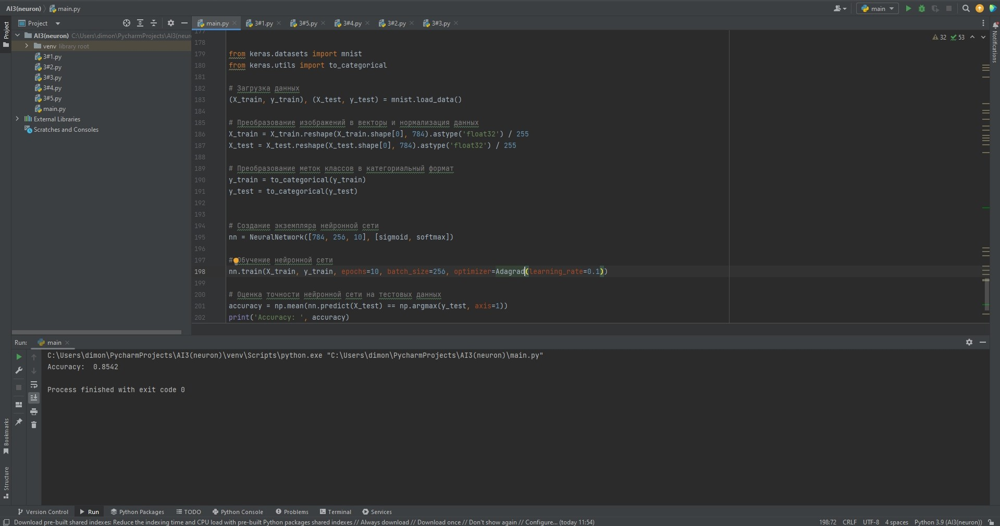
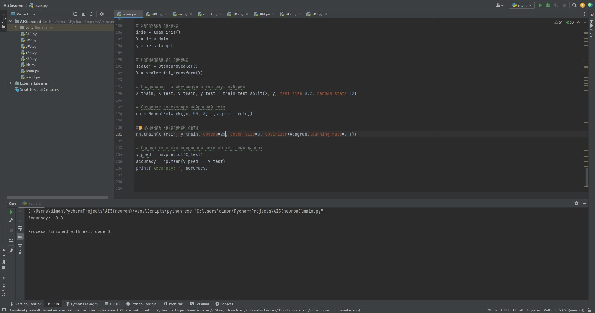

# Лабораторная работа по курсу "Искусственный интеллект"
# Создание своего нейросетевого фреймворка 

### Студенты: 

| ФИО       | Роль в проекте                     | Оценка       |
|-----------|------------------------------------|--------------|
| Цыбенко | Руководил и программировал |          |
| Ткаченко | Программировал оптимизаторы |       |
| Николаева  | Проведение тестов и написание отчёта |          |

> *Комментарии проверяющего*

### Задание

Реализовать свой нейросетевой фреймворк для обучения полносвязных нейросетей, который должен включать в себя следующие возможности:

1. Создание многослойной нейросети перечислением слоёв
1. Удобный набор функций для работы с данными и датасетами (map, minibatching, перемешивание и др.)
1. Несколько (не менее 3) алгоритмов оптимизации: SGD, Momentum SGD, Gradient Clipping и др.
1. Описание нескольких передаточных функций и функций потерь для решения задач классификации и регрессии.
1. Обучение нейросети "в несколько строк", при этом с гибкой возможностью конфигурирования
1. 2-3 примера использования нейросети на классических задачах (MNIST, Iris и др.)
1. Документация в виде файла README.md 

### Документация

Класс NeuralNetwork представляет собой нейронную сеть с возможностью обучения и предсказания. Ниже опишем подробнее различные части этого класса:

1. __init__: Инициализирует объект нейронной сети. Принимает список layers, который определяет количество нейронов на каждом слое, и список activations, содержащий функции активации для слоев. Веса и смещения инициализируются случайными значениями.
2. forward: Выполняет прямое распространение по нейронной сети. Принимает входные данные x и последовательно применяет функции активации к линейным комбинациям входов и весов каждого слоя.
3. train: Обучает нейронную сеть на основе предоставленных данных. Принимает входные данные X_train, целевые значения y_train, количество эпох epochs, размер пакета batch_size и оптимизатор optimizer. Во время обучения все данные перемешиваются и разбиваются на пакеты, после чего происходит обратное распространение ошибки и обновление весов и смещений с помощью оптимизатора.
4. backprop: Выполняет обратное распространение ошибки для обновления весов и смещений нейронной сети. Расчет градиентов происходит с помощью последовательного применения правила цепной дифференциации. Здесь используются значения активаций и линейных комбинаций из прямого распространения.
5. predict: Прогнозирует выходные значения для входных данных X. Выполняет прямое распространение по нейронной сети и возвращает индекс класса с наибольшим значением в выходном слое.

Далее приведем примеры использования нейросети на двух задачах.

1. Первая задача MNIST, получаем более 85% accuracy

2. Вторая задача Iris, здесь мы получили ровно 80% accuracy

